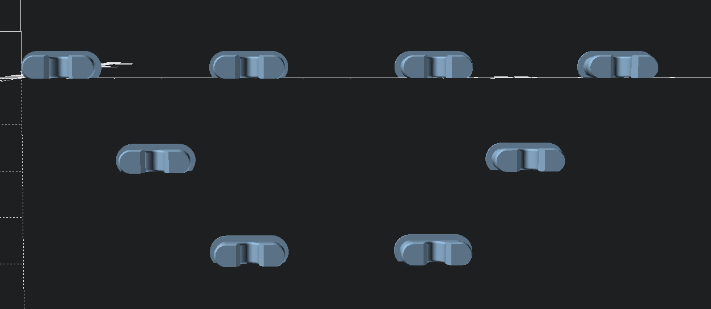
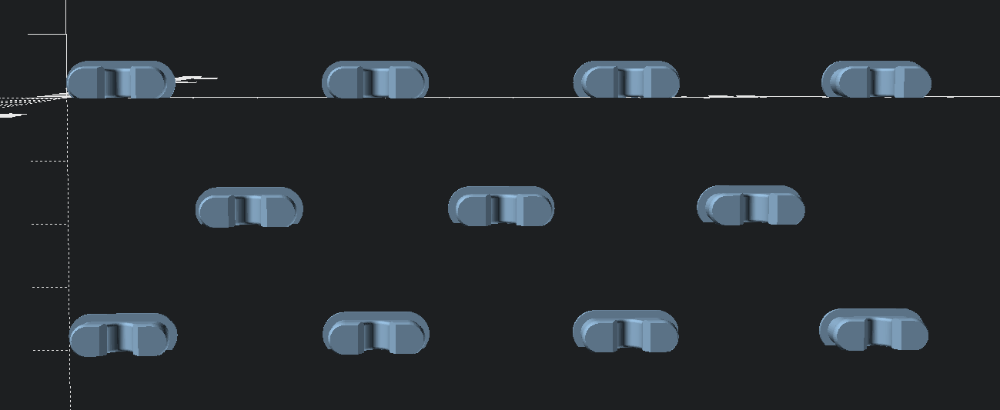

# IKEA Skadis Horizontal Peg Generator

This week-end, I made a mistake, I bought an IKEA Skadis 76x56 cm. My plan was to put the board vertically, but it is not made to work that way. As I recently bought a 3D printer, I decided to embrace the chaos and build the hooks myself. I am not sure how it will end up, but I am having fun. While I was searching on the internet, I found that MISTRY3DESIGN did the hard work, you can find his work here https://cults3d.com/en/3d-model/tool/skadis-horizontal-pegboard-mounts (Thank you !).

I do not have a lot experience with OpenScad, so it is normal if you find weird stuff. 😉

## Usage

### generateHorizontalPegsFromGraph(...)

#### Code

```scad
use <../librairies/skadis-horizontal-peg-generator/src/generator.scad>

generateHorizontalPegsFromGraph([
    [true, true, true, true],
    [true, false, true],
    [false, true, true, false],
]);
```

#### Capture



### generateHorizontalPegsFromTopToRight(...)

### generateHorizontalPegsFromTopToLeft(...)

### generateHorizontalPegsFromBottomToRight(...)

### generateHorizontalPegsFromBottomToLeft(...)

These four methods generate the pegs from the origin position and the direction you want.

#### Code

```scad
use <../librairies/skadis-horizontal-peg-generator/src/generator.scad>

generateHorizontalPegsFromTopToRight(columns = 4, rows = 3);
```

#### Capture


